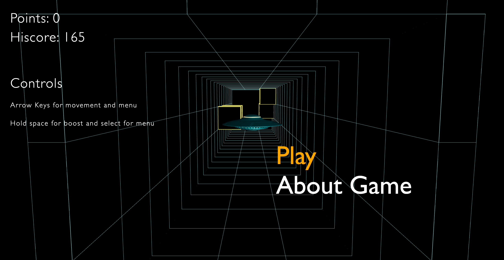
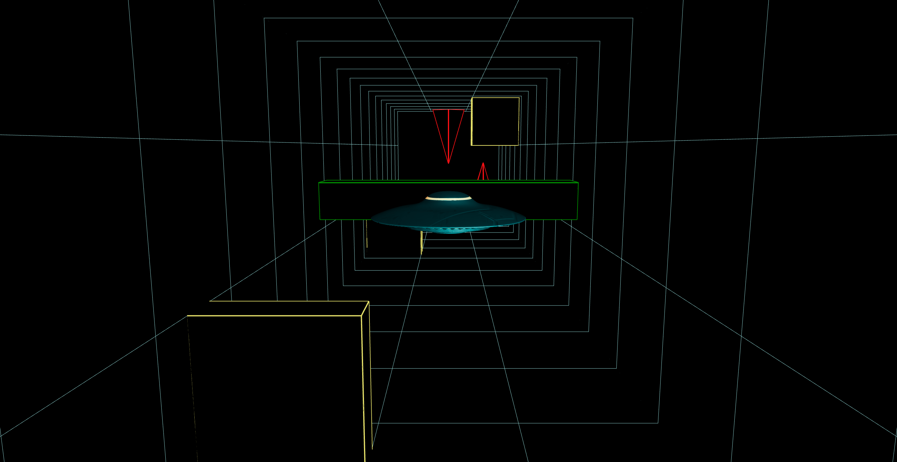

# Alien Trap Run 

## 🎮 [CLICK AND PLAY NOW!](https://ignaulis.github.io/r3f_game__alien_trap_run/)

Alien Trap Run is a 3D game built with React and Three.js libraries. In this game, you pilot an alien spacecraft through a tunnel filled with randomly generated spikes. Avoid collisions and travel as far as possible to rack up points—the farther you go, the higher your score. All scores are saved locally so you can continuously challenge your best performance.

## 📑 Table of Contents

- [Overview](#-overview)
- [Preview](#-preview)
- [Features](#-features)
- [Gameplay](#-gameplay)
- [Technologies](#-technologies)
- [Controls](#-controls)
- [Getting Started](#-getting-started)
- [Where To Improve](#-Where-To-Improve)
- [License](#-license)

## 🧠 Overview

Alien Trap Run challenges players to navigate a fast-moving tunnel cluttered with spikes. The spikes are generated using random functions, ensuring a unique path every time you play. The game combines arcade-style excitement with smooth, responsive controls that work on both desktop and mobile devices.

## 📸 Preview




## ✨ Features

- **Dynamic Environment:** Randomly generated spikes create a new challenge in every playthrough.
- **Local Score Storage:** Your high scores are saved in localStorage, letting you track your progress over time.
- **Responsive Controls:** 
  - **Desktop:** Use the arrow keys for navigation and hold the spacebar to boost your speed.
  - **Mobile:** Intuitive on-screen buttons appear for steering and boosting when playing on a mobile device.
- **Cross-Platform Compatibility:** Designed to work seamlessly across both desktop and mobile platforms.

## 🕹 Gameplay

You control an agile alien ship navigating through a tunnel packed with spikes. The goal is to avoid the spikes for as long as possible, accumulating points the further you travel. A collision ends the game, so each session challenges you to improve your personal best.

## 🛠 Technologies

This game is built with the following libraries and frameworks:

- **@react-three/drei** (v10.0.6)
- **@react-three/fiber** (v9.1.2)
- **@react-three/rapier** (v2.1.0)
- **r3f-perf** (v7.2.3)
- **React** (v19.0.0) & **React-DOM** (v19.0.0)
- **Three.js** (v0.175.0)

## 🎮 Controls

### Desktop

- **Arrow Keys:** Steer the alien ship.
- **Spacebar:** Hold to boost the ship’s speed.

### Mobile

- **On-Screen Buttons:** Touch controls appear on mobile devices:
  - **Directional Buttons** for steering.
  - **Boost Button** to accelerate.

## 🚀 Getting Started

### Prerequisites

- [Node.js](https://nodejs.org/) (latest version recommended)
- npm or yarn package manager

### Installation

1. **Clone the repository:**

```
  git clone https://github.com/Ignaulis/r3f_game__alien_trap_run.git
  cd alien-trap-run
```
2. **Install dependencies:**

```
npm install
# or
yarn install
```
3. **Start the development server:**

```
npm start
# or
yarn start
```

4. **Open your browser:**
   
Open your browser to http://localhost:3000 to play the game.

## 📈 Where To Improve

- **Enhanced Visual Effects:** Like lighting, particle effects, and textures.
- **Sound and Music:** Engaging of soundtracks and sound effects.
- **Leaderboard Integration:** Adding online leaderboards for global competition.
- **Additional Power-ups:** Diversifying gameplay with new power-ups and obstacles.
- **Performance Optimization:** Improve overall game performance for smoother and more responsive gameplay.
- **Mobile Optimization:** Enhance and fine-tune the experience specifically for mobile devices.

## 📄 License
This project is licensed under the MIT License.
